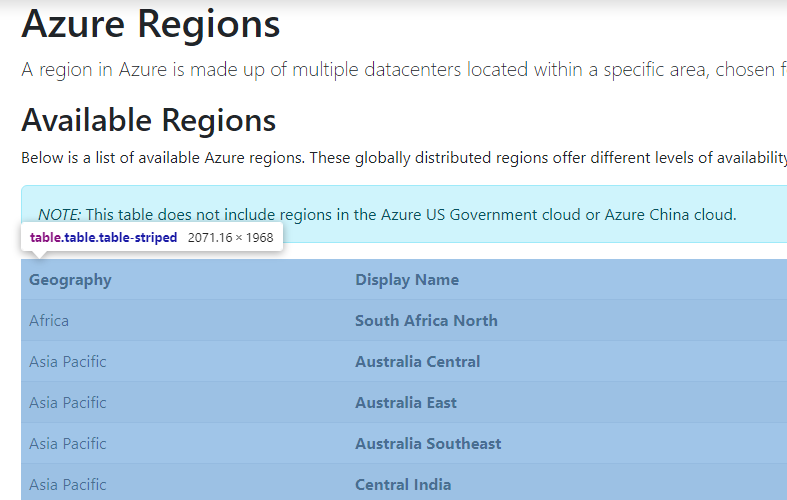
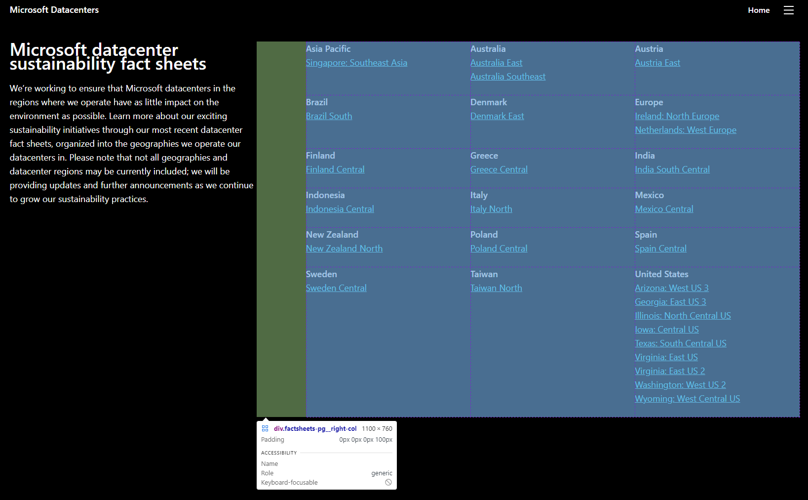
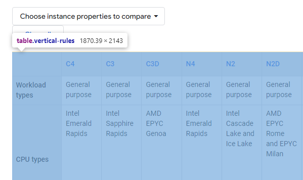

# Cloud Provider Dataset

Dataset for the Cloud Providers Microsoft Azure and Google Cloud Platform (GCP).

## Table of Content

* [Raw Datasets](dataset)
* [Azure Web Scraper](azure-web-scraper/src/main/java/cloud/dataset/scraper)
* [Google Cloud Platform Web Scraper](gcp-web-scraper/src/main/java/cloud/dataset/scraper)

## Installation

Tested on __OpenJDK 17.0.2__ & __Maven 3.6.3__.

```shell
mvn clean install -DskipTests
```

## Dataset Update

### [Azure Machines](./dataset/azure-machines.csv)

Extracted
from [https://learn.microsoft.com/en-us/azure/virtual-machines/linux/compute-benchmark-scores](https://learn.microsoft.com/en-us/azure/virtual-machines/linux/compute-benchmark-scores)
with the responsible __Web Scraper__.

```shell
cd azure-web-scraper
java -jar ./target/exectuable.jar
```

### [Azure Regions](./dataset/azure-regions.csv)

* [https://www.azurespeed.com/Information/AzureRegions](https://www.azurespeed.com/Information/AzureRegions)
* [azure-data-regions.html](./azure-web-scraper/src/main/resources/data/azure-data-regions.html)

Copy the `<table>` element of the table on the website and use it in the resources with minimal reformatting.

<details>
  <summary>Website Element Screenshot</summary>



</details>

Then run the responsible __Web Scraper__.

```shell
cd azure-web-scraper
java -jar ./target/exectuable.jar
```

### [Azure Sustainability](./dataset/azure-sustainability.csv)

* [https://datacenters.microsoft.com/globe/fact-sheets/](https://datacenters.microsoft.com/globe/fact-sheets/)
* [azure-data-sustainability.html](./azure-web-scraper/src/main/resources/data/azure-data-sustainability.html)

Copy the `<div>` element of the table on the website and use it in the resources with minimal reformatting.

<details>
  <summary>Website Element Screenshot</summary>



</details>

Then run the responsible __Web Scraper__.

```shell
cd azure-web-scraper
java -jar ./target/exectuable.jar
```

### [Hardware Embodied Emissions](./dataset/embodied-emission-data.csv)

Copied from the
[https://docs.google.com/spreadsheets](https://docs.google.com/spreadsheets/d/1k-6JtneEu4E9pXQ9QMCXAfyntNJl8MnV2YzO4aKHh-0/edit?gid=0#gid=0)
of [https://www.cloudcarbonfootprint.org/docs/embodied-emissions/](https://www.cloudcarbonfootprint.org/docs/embodied-emissions/).

### [GCP CPUs](./dataset/gcp-cpus.csv)

Extracted
from [https://cloud.google.com/compute/docs/cpu-platforms](https://cloud.google.com/compute/docs/cpu-platforms?hl=en)
with the responsible __Web Scraper__.

```shell
cd gcp-web-scraper
java -jar ./target/exectuable.jar
```

### [GCP Data Center CFE](./dataset/gcp-data-centers-cfe.csv)

* [https://cloud.google.com/sustainability/region-carbon](https://cloud.google.com/sustainability/region-carbon)
* [gcp-data-center-cfe.csv](dataset/gcp-data-centers-cfe.csv)

Queried from [BigQuery](https://console.cloud.google.com/bigquery?p=bigquery-public-data&d=google_cfe&page=dataset) and
saved as CSV:

```
SELECT year,cloud_region,location,zone_id,cfe_region,google_cfe FROM `bigquery-public-data.google_cfe.datacenter_cfe` WHERE year=2021 LIMIT 1000
```

### [GCP Data Center PUE](./dataset/gcp-data-centers-pue.csv)

* [https://www.google.com/about/datacenters/efficiency/](https://www.google.com/about/datacenters/efficiency/)
* [gcp-data-centers-pue.csv](./dataset/gcp-data-centers-pue.csv)

Created by hand and matched with the cloud regions. A lot of table entries could not find a match with the regions:

* Lenoir, North Carolina
* Montgomery County, Tennessee
* Jackson County, Alabama
* Papillion, Nebraska
* Mayes County, Oklahoma

### [GCP Machines](./dataset/gcp-machines.csv)

* [https://cloud.google.com/compute/docs/machine-resource](https://cloud.google.com/compute/docs/machine-resource?hl=en)
* [gcp-region-hardware.html](./gcp-web-scraper/src/main/resources/data/gcp-data-machines.html)

Copy the `<table>` element of the table on the website and use it in the resources with minimal reformatting.

<details>
  <summary>Website Element Screenshot</summary>



</details>

Then run the responsible __Web Scraper__.

```shell
cd gcp-web-scraper
java -jar ./target/exectuable.jar
```


### [GCP Region Hardware](./dataset/gcp-region-hardware.csv)

Extracted
from [https://cloud.google.com/compute/docs/regions-zones](https://cloud.google.com/compute/docs/regions-zones?hl=en)
with the responsible __Web Scraper__.

```shell
cd gcp-web-scraper
java -jar ./target/exectuable.jar
```
